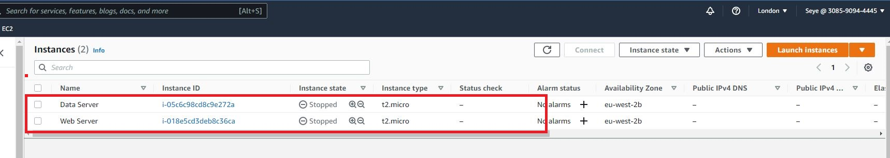

## WEB SOLUTION WITH WORDPRESS

In this project I will be setting up a storage infrastructure on two Linux servers, implement a basic web solution using WordPress and MySQL as its backend database Relational Database Management System (RDBMS).

This project is divided into two stages

First stage : Configure storage subsystem for Web and Database servers based on Linux OS. This involves working with disks, partitions and volumes in Linux.

Second stage : Install WordPress and connect it to a remote MySQL database server.

Now with the first stage I will create two Linux servers, one for Web server and the other for Database server

Next - Create 3 disk each 10GB in size for both Web server & Database server, attach them to both servers.

Launch the Linux Webserver, open terminal to begin configuration.  

Run <code>lsblk</code> command to inspect what block devices are attached to the server.

Run <code>gdisk</code> utility to create a single partition on each of the 3 disks

<code>sudo gdisk /dev/xvdf</code>

Type <code>n</code> to create a new partition,

Select <code>1</code> to set it as default partition number

Type <code>p</code> to preview the changes made 

Type <code>w</code> to write to disk 

Finally type <code>y</code> to confirm to proceed.

Do this for the next 2 disk. 

<code>sudo gdisk /dev/xvdh</code>

<code>sudo gdisk /dev/xvdg</code>

Use the <code>lsblk</code> utility to view the newly configured partition on each of the 3 disk

 
 Next install lvm2 package using <code>sudo yum install lvm2</code>

 

 

 Use <code>pvcreate</code> utility to mark each of the 3 disk as a physical volumes (PVs) to be used by LVM.

 <code> sudo pvcreate /dev/xvdf1</code>

<code>sudo pvcreate /dev/xvdg1</code>

<code>sudo pvcreate /dev/xvdh1</code>

Verify that your Physical volume has been created successfully by running <code>sudo pvs</code>

Use vgcreate utility to add all 3 PVs to a volume group (VG). Name the VG webdata-vg

<code>sudo vgcreate webdata-vg /dev/xvdh1 /dev/xvdg1 /dev/xvdf1</code>

Verify that your VG has been created successfully by running <code>sudo vgs</code>

Now repeat the steps above to configure 3 Disk for Data server 

Next use <code>lvcreate</code> utility to create 2 logical volumes. apps-lv (Use half of the PV size), and logs-lv Use the remaining space of the PV size.

NOTE: apps-lv will be used to store data for the Website while, logs-lv will be used to store data for logs.

<code>sudo lvcreate -n apps-lv -L 14G webdata-vg</code>

<code>sudo lvcreate -n logs-lv -L 14G webdata-vg</code>

